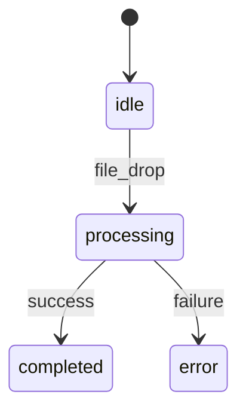

# /export [format] [target]

스펙을 다른 형식으로 내보냅니다.

## 개요

지원 형식:
- `markdown` - 읽기 쉬운 문서 형태
- `json` - 프로그래밍/API 연동용
- `mermaid` - 다이어그램 시각화
- `csv` - 스프레드시트용 (태스크 목록 등)

## 사용법
````
/export markdown              # 전체를 마크다운으로
/export markdown requirements # 요구사항만
/export json functional       # 기능 명세를 JSON으로
/export mermaid states        # 상태 다이어그램
/export csv tasks             # 태스크 목록을 CSV로
````

## 내보내기 형식별 상세

### Markdown 내보내기
````
/export markdown
````

출력 파일: `exports/specs-[날짜].md`
````markdown
# [Project Name] 스펙 문서

생성일: 2024-01-15
버전: 0.2.0

## 1. 개요

### 핵심 가치
[idea-crystal.core_value]

### 타겟 사용자
[idea-crystal.target_user]

### 성공 지표
| 지표 | 현재 | 목표 |
|------|------|------|
| [metric] | [current] | [target] |

## 2. 요구사항

### US-001: [제목]
- **사용자**: [as_a]
- **목표**: [i_want]
- **가치**: [so_that]
- **우선순위**: [priority]

**인수 조건:**
1. [acceptance_criteria[0]]
2. [acceptance_criteria[1]]

... (이하 생략)

## 3. 기능 명세

### F-001: [기능명]

**상태 다이어그램:**


**에러 케이스:**
| 조건 | 코드 | 메시지 |
|------|------|--------|
| [condition] | [code] | [message] |

...
````

### JSON 내보내기
````
/export json functional
````

출력 파일: `exports/functional-spec-[날짜].json`
````json
{
  "version": "0.2.0",
  "exported_at": "2024-01-15T10:30:00Z",
  "functional_spec": {
    "features": [
      {
        "id": "F-001",
        "name": "PDF 업로드 및 파싱",
        "states": [...],
        "error_cases": [...],
        "edge_cases": [...]
      }
    ]
  }
}
````

### Mermaid 다이어그램 내보내기
````
/export mermaid states
````

출력: 각 Feature의 상태 다이어그램
````
📊 상태 다이어그램 생성

F-001: PDF 업로드 및 파싱
┌─────────────────────────────────
│ stateDiagram-v2
│     [*] --> idle
│     idle --> validating: file_drop
│     validating --> parsing: valid
│     validating --> error: invalid
│     parsing --> completed: success
│     parsing --> error: failure
│     error --> idle: retry
│     completed --> idle: reset
└─────────────────────────────────

F-002: 용어 설명
┌─────────────────────────────────
│ stateDiagram-v2
│     [*] --> idle
│     idle --> loading: term_click
│     loading --> showing: loaded
│     loading --> error: failed
│     showing --> idle: close
└─────────────────────────────────

파일로 저장할까요? (y/n)
→ exports/state-diagrams-[날짜].md
````
````
/export mermaid architecture
````

출력: 아키텍처 다이어그램
````
📊 아키텍처 다이어그램

┌─────────────────────────────────
│ flowchart TB
│     subgraph Client
│         Next[Next.js App]
│         UI[React Components]
│     end
│     
│     subgraph Server
│         API[API Routes]
│         Parser[PDF Parser]
│     end
│     
│     subgraph External
│         DB[(Supabase)]
│         AI[Claude API]
│     end
│     
│     Next --> UI
│     UI --> API
│     API --> Parser
│     API --> DB
│     API --> AI
└─────────────────────────────────
````
````
/export mermaid dependencies
````

출력: 기능/태스크 의존성 그래프
````
📊 의존성 그래프

Features:
┌─────────────────────────────────
│ graph LR
│     F-001[PDF 업로드] --> F-002[PDF 파싱]
│     F-002 --> F-003[용어 추출]
│     F-002 --> F-004[섹션 분리]
│     F-003 --> F-005[용어 설명]
│     F-004 --> F-006[요약 생성]
└─────────────────────────────────

Tasks:
┌─────────────────────────────────
│ graph LR
│     T1[TASK-001] --> T3[TASK-003]
│     T2[TASK-002] --> T3
│     T3 --> T4[TASK-004]
│     T3 --> T5[TASK-005]
└─────────────────────────────────
````

### CSV 내보내기
````
/export csv tasks
````

출력 파일: `exports/tasks-[날짜].csv`
````csv
ID,Feature,Name,Type,Priority,Status,Dependencies,Acceptance Criteria
TASK-001,F-001,PDF 업로드 컴포넌트,frontend,1,completed,,Given PDF 파일을 드래그...
TASK-002,F-001,PDF 파싱 API,backend,1,completed,,Given 유효한 PDF...
TASK-003,F-002,용어 추출 로직,backend,2,in_progress,"TASK-001,TASK-002",Given 파싱된 문서...
````
````
/export csv requirements
````

출력 파일: `exports/requirements-[날짜].csv`
````csv
ID,Priority,As A,I Want,So That,Acceptance Criteria Count,Features
US-001,must,대학원생,PDF 업로드,바로 읽기 시작,3,"F-001,F-002"
US-002,must,대학원생,용어 설명,검색 없이 이해,2,"F-003,F-005"
````

## 완료 메시지
````
✅ 내보내기 완료!

형식: Markdown
대상: 전체 스펙
파일: exports/specs-2024-01-15.md

파일 크기: 24KB
포함된 내용:
- 요구사항: 5개
- 기능: 8개
- API: 6개
- 화면: 3개

팁: 이 파일을 팀과 공유하거나 문서 도구에 붙여넣을 수 있습니다.
````

## 에러 처리

- 스펙 파일이 없으면: 먼저 스펙 생성 필요 안내
- 잘못된 형식 지정: 지원 형식 목록 표시
- exports 폴더가 없으면: 자동 생성